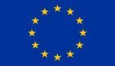

# Tristan and ISOLDE Unified Access Page

It provides references and descriptions of all the [TRISTAN](https://tristan-project.eu/) and [ISOLDE](https://isolde-project.eu/) IPs (hardware and software).
It serves as a `Virtual Repository` page, gathering all the information about the TRISTAN and ISOLDE repositories, their status,
and the TRISTAN and ISOLDE partners involved in them.
The Tristan and ISOLDE Unified Access Page acts like a static page, to provide a single access point to all the repositories TRISTAN and ISOLDE 
contributes to. The updates and contributions will be upstreamed in the repository themselves.

Some of the repositories are hosted on the OpenHW Group GitHub forge, some are located on other public pages, and some are closed-source.
The diagram below shows how the TRISTAN and ISOLDE repositories are organized.

The Tristan and ISOLDE Unified Access Page are the deliverable of the TRISTAN Task 2 of the Work Package 7 (7.2) and ISOLDE Task 1 of the Work Package 6 (T6.1).

You can access the Tristan and ISOLDE Unified Access Page [here](https://htmlpreview.github.io/?https://github.com/openhwgroup/tristan-unified-access-page/blob/main/tristan-isolde-unified-access-page.html).

# Acknowledgements

TRISTAN has received funding from the Chips Joint Undertaking (Chips JU) under grant agreement nr. 101095947. The Chips JU receives support from the European Union’s Horizon Europe’s research and innovation programmes and participating states are Austria, Belgium, Bulgaria, Croatia, Cyprus, Czechia, Germany, Denmark, Estonia, Greece, Spain, Finland, France, Hungary, Ireland, Israel, Iceland, Italy, Lithuania, Luxembourg, Latvia, Malta, Netherlands, Norway, Poland, Portugal, Romania, Sweden, Slovenia, Slovakia, Turkey.

ISOLDE has received funding from the Chips Joint Undertaking (Chips JU) under grant agreement nr. 101112274. The Chips JU receives support from the European Union’s Horizon Europe’s research and innovation programmes and participating states are Austria, Czechia, France, Germany, Italy, Romania, Spain, Sweden, Switzerland.

&nbsp;&nbsp;&nbsp;&nbsp;&nbsp;&nbsp;&nbsp;&nbsp;
